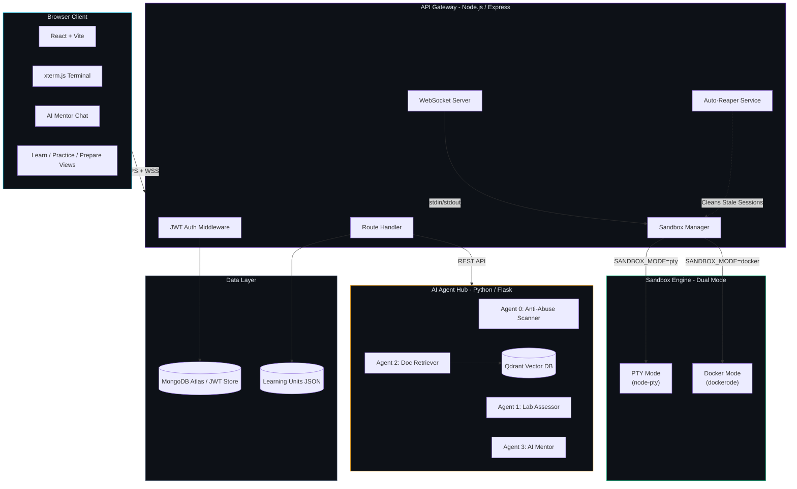
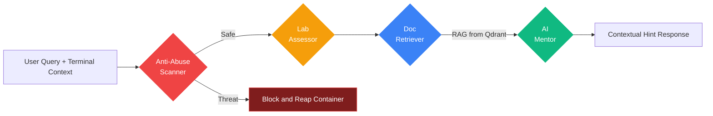
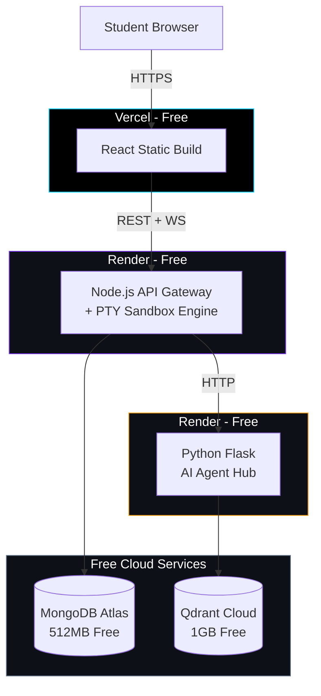
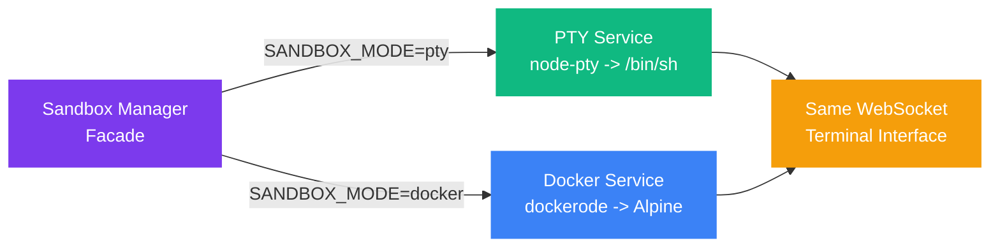

<div align="center">

# OpsAcademy

### AI-Driven DevOps Sandbox Learning Platform

[](https://nodejs.org)
[](https://react.dev)
[](https://python.org)
[](https://docker.com)
[](LICENSE)

**Learn DevOps by doing, not watching.** OpsAcademy is an interactive, browser-based learning platform where students master cloud engineering through a 3-mode learning system (Learn, Practice, Prepare) featuring live sandboxed terminals and AI-powered mentoring.

[Live Demo](#) | [Architecture](#architecture) | [Quick Start](#quick-start) | [Tech Stack](#tech-stack)

</div>

---

## Key Features

| Feature | Description |
|---|---|
| **8 A-to-Z DevOps Courses** | Comprehensive curriculum covering Linux, Git, Docker, Kubernetes, Networking, CI/CD, AWS Cloud, and Monitoring |
| **3-Mode Learning System** | Learn (theory & concept quizzes), Practice (live terminal lab), and Prepare (flashcards & placement Q&A) for every unit |
| **Mermaid.js Diagram Engine** | Client-side interactive vector diagrams (flowcharts, sequence diagrams, architecture maps) with dark-theme styling |
| **Live Terminal** | Real Linux shell in the browser via `xterm.js` + WebSocket streaming with <50ms latency |
| **AI Mentor** | Multi-agent RAG system (LangGraph + Qdrant) that reads container state and provides hints — never direct answers |
| **Sandbox Security** | Isolated containers with cgroup memory/CPU limits, read-only rootfs, and network sub-bridging |
| **Auto-Grading Verification** | Automated verification engine executing shell test commands inside active sandboxes |
| **Dual-Mode Engine** | Pluggable sandbox backend: `node-pty` for cloud deployment, `dockerode` for production Docker isolation |
| **Auto-Reaper Cleanup** | Background process that automatically cleans up stale sandbox sessions older than 30 minutes |
| **Anti-Abuse Detection** | Isolation Forest ML model + regex pipeline to block fork bombs, crypto miners, and host-escape exploits |
| **College Placement Readiness** | Structured 3-mode curriculum designed for campus bootcamps, TPO reporting, and technical interview prep |

---

## Architecture

### High-Level System Design



### Multi-Agent Pipeline (LangGraph)



### Deployment Architecture (Free Tier)



---

## Tech Stack

### Frontend
| Technology | Purpose |
|---|---|
| **React 19** + **Vite** | SPA framework with HMR |
| **xterm.js** | Terminal emulator with WebSocket I/O |
| **React Router v7** | Client-side routing for 3-mode learning views |
| **Axios** | HTTP client with auth interceptors |
| **Lucide React** | Icon library |
| **CSS3** | Custom design system — glassmorphism, gradients, micro-animations, 3D card flips |

### Backend (API Gateway)
| Technology | Purpose |
|---|---|
| **Node.js** + **Express** | REST API server |
| **ws** | WebSocket server for terminal streaming |
| **node-pty** | PTY sandbox engine (local/cloud mode) |
| **dockerode** | Docker sandbox engine (production mode) |
| **JWT** + **bcryptjs** | Authentication and password hashing |

### AI Agent Hub
| Technology | Purpose |
|---|---|
| **Python** + **Flask** | AI microservice |
| **LangGraph** | Multi-agent orchestration framework |
| **Qdrant** | Vector database for RAG retrieval |
| **sentence-transformers** | Document embedding model |
| **scikit-learn** | Isolation Forest for anomaly detection |

### Infrastructure
| Technology | Purpose |
|---|---|
| **Docker** + **Docker Compose** | Local containerized development |
| **Kubernetes** | Production manifests (deployment, service, ingress) |
| **Vercel** | Frontend hosting (free) |
| **Render** | Backend hosting (free) |
| **MongoDB Atlas** | User data persistence (free 512MB) |
| **Qdrant Cloud** | Vector storage (free 1GB) |

---

## Quick Start

### Prerequisites

- **Node.js** >= 18 ([Download](https://nodejs.org))
- **npm** >= 9
- **Docker Desktop** (optional, for Docker sandbox mode)

### 1. Clone and Install

```bash
git clone https://github.com/YOUR_USERNAME/opsacademy.git
cd opsacademy

# Install server dependencies
cd server && npm install

# Install client dependencies
cd ../client && npm install
```

### 2. Configure Environment

```bash
# Server environment
cp server/.env.example server/.env
# Edit server/.env and set JWT_SECRET to a secure random string
```

### 3. Run Development Servers

```bash
# Terminal 1 - Start the API Gateway
cd server && npm run dev
# Server running at http://localhost:4000 (PTY mode)

# Terminal 2 - Start the React Client
cd client && npm run dev
# Client running at http://localhost:5173
```

### 4. Open in Browser

Navigate to `http://localhost:5173` > Click **Start Learning** > Choose a Learning Unit > Choose Learn, Practice, or Prepare mode.

---

## Project Structure

```
opsacademy/
|-- client/                          # React frontend (Vite)
|   |-- src/
|   |   |-- components/
|   |   |   |-- Navbar/              # Navigation bar with mode status
|   |   |   |-- Terminal/            # xterm.js WebSocket terminal
|   |   |   |-- Quiz/                # Multiple-choice concept check component
|   |   |   +-- Flashcard/           # Interactive 3D flip card component
|   |   |-- pages/
|   |   |   |-- LandingPage.jsx      # Hero + features + architecture
|   |   |   |-- DashboardPage.jsx    # Unit catalog with 3-mode buttons
|   |   |   |-- LearnPage.jsx        # Mode 1: Theory reader + quizzes
|   |   |   |-- LabPage.jsx          # Mode 2: Live terminal lab + verification
|   |   |   +-- PreparePage.jsx      # Mode 3: Flashcards + placement Q&A
|   |   |-- services/
|   |   |   +-- api.js               # Axios client + WS URL helper
|   |   |-- App.jsx                  # Router setup
|   |   +-- index.css                # Design system (CSS custom properties)
|   |-- index.html                   # SEO-optimized HTML shell
|   +-- package.json
|
|-- server/                          # Node.js API Gateway
|   |-- config/
|   |   +-- index.js                 # Centralized config (env vars)
|   |-- data/
|   |   +-- units/                   # 8 Complete Learning Units
|   |       |-- linux-basics/        # Linux Fundamentals (8 sections)
|   |       |-- git-basics/          # Git & GitHub Workflow (7 sections)
|   |       |-- docker-basics/       # Docker Fundamentals (8 sections)
|   |       |-- kubernetes-basics/   # Kubernetes Orchestration (8 sections)
|   |       |-- networking-fundamentals/ # Networking (6 sections)
|   |       |-- cicd-pipelines/      # CI/CD Pipelines (6 sections)
|   |       |-- aws-cloud-essentials/ # Cloud Computing / AWS (6 sections)
|   |       +-- monitoring-observability/ # Monitoring & Observability (5 sections)
|   |-- middleware/
|   |   |-- auth.js                  # JWT authorization middleware
|   |   +-- errorHandler.js          # Global JSON error handler
|   |-- routes/
|   |   |-- sandboxRoutes.js         # Sandbox lifecycle REST API
|   |   |-- unitRoutes.js            # Learning units & mode content API
|   |   |-- labRoutes.js             # Sandbox test verification API
|   |   +-- authRoutes.js            # Register, login, profile API
|   |-- services/
|   |   |-- ptyService.js            # PTY sandbox engine (node-pty)
|   |   |-- dockerService.js         # Docker sandbox engine (dockerode)
|   |   |-- sandboxManager.js        # Pluggable facade (mode switching)
|   |   |-- terminalService.js       # WebSocket terminal stream handler
|   |   +-- reaperService.js         # Auto-cleanup for stale sandboxes
|   |-- server.js                    # Express + WS bootstrap
|   |-- .env.example                 # Environment template
|   +-- package.json
|
|-- ai-hub/                          # Python AI Agent Hub (Phase 3)
|-- docker/                          # Dockerfiles (Phase 4)
|-- k8s/                             # Kubernetes manifests (Phase 4)
|-- .gitignore
+-- README.md
```

---

## API Reference

### Sandbox Management

| Method | Endpoint | Description |
|---|---|---|
| `POST` | `/api/sandbox/start` | Create a new sandbox session |
| `DELETE` | `/api/sandbox/:sessionId` | Destroy a sandbox session |
| `GET` | `/api/sandbox/:sessionId/status` | Get sandbox info |
| `GET` | `/api/sandbox` | List all active sandboxes |
| `GET` | `/api/health` | Health check + sandbox mode |

### Learning Units & Labs

| Method | Endpoint | Description |
|---|---|---|
| `GET` | `/api/units` | List all learning units metadata |
| `GET` | `/api/units/:unitId` | Get metadata for a specific unit |
| `GET` | `/api/units/:unitId/:mode` | Get content for mode (`learn`, `practice`, `prepare`) |
| `POST` | `/api/labs/:unitId/verify` | Run verification checks inside active sandbox |

### Authentication

| Method | Endpoint | Description |
|---|---|---|
| `POST` | `/api/auth/register` | Register a new user |
| `POST` | `/api/auth/login` | Authenticate user and receive JWT |
| `GET` | `/api/auth/me` | Fetch authenticated user profile |

### WebSocket

| Endpoint | Protocol | Description |
|---|---|---|
| `/api/terminal?sessionId=<id>` | `ws://` | Interactive terminal stream |

**WebSocket Messages:**

```
Browser -> Server:  raw keystrokes (UTF-8 text)
Browser -> Server:  {"type":"resize","cols":120,"rows":30}  (JSON control)
Server -> Browser:  terminal stdout output (UTF-8 text)
```

---

## Security Model

### Sandbox Isolation

| Layer | Protection |
|---|---|
| **Memory** | cgroup hard limit: 256MB per container |
| **CPU** | cgroup limit: 0.5 cores per container |
| **Filesystem** | Read-only rootfs; writable only `/home/student` and `/tmp` |
| **Network** | Isolated bridge network — no external internet by default |
| **Privileges** | `no-new-privileges` security option |
| **Lifecycle** | Auto-reaper kills containers after 30 minutes |

### Application Security

| Concern | Mitigation |
|---|---|
| **Secrets** | All secrets via environment variables; `.env` excluded from git |
| **Auth** | JWT tokens with configurable expiry; bcrypt password hashing |
| **CORS** | Restricted to configured `CLIENT_URL` origin |
| **Input** | AI Anti-Abuse agent scans all commands before execution |
| **Dependencies** | Regular `npm audit` scanning |

---

## Dual-Mode Sandbox Engine

OpsAcademy features a **pluggable sandbox architecture** — a single environment variable switches the entire backend:

```
SANDBOX_MODE=pty      # Local shell via node-pty (development + Render)
SANDBOX_MODE=docker   # Docker containers via dockerode (VPS production)
```



**Why?** Cloud platforms like Render don't provide Docker socket access. PTY mode enables free-tier deployment while Docker mode provides full production isolation on a VPS.

---

## Roadmap

- [x] **Phase 1** — Terminal streaming core (WebSocket + xterm.js + PTY/Docker)
- [x] **Phase 1** — React frontend (Landing, Dashboard, Lab pages)
- [x] **Phase 1** — Dual-mode sandbox engine
- [x] **Phase 2** — 3-Mode Learning System (Learn, Practice, Prepare)
- [x] **Phase 2** — Automated lab verification engine
- [x] **Phase 2** — JWT authentication API & bcrypt hashing
- [x] **Phase 2** — Auto-reaper background cleanup service
- [x] **Phase 3** — Student Placement Toolkit (Readiness score & progress engine)
- [x] **Phase 3** — Course content expansion (Git & Kubernetes units)
- [x] **Phase 3** — Shareable completion certificate generator
- [x] **Phase 4** — Python AI Agent Hub (Flask + LangGraph multi-agent graph)
- [x] **Phase 4** — RAG with Qdrant vector DB
- [x] **Phase 4** — Anti-abuse ML detection (Isolation Forest)
- [x] **Phase 5** — Docker Compose & Kubernetes production manifests
- [x] **Phase 5** — Production deployment to Vercel + Render

---

## Engineering Highlights

| Metric / Pattern | Detail |
|---|---|
| **Terminal Latency** | <50ms keystroke-to-render via WebSocket binary frames |
| **Sandbox Isolation** | cgroup memory caps + read-only rootfs + network sub-bridging |
| **Pluggable Architecture** | Strategy pattern — swap sandbox engines via env var |
| **3-Mode Learning Engine** | Structured Learn theory, Practice terminal lab, Prepare interview Q&A |
| **Multi-Agent AI** | LangGraph pipeline: Abuse Scanner > Lab Assessor > Doc Retriever > Mentor |
| **RAG Pipeline** | Sentence-transformer embeddings > Qdrant similarity search > LLM synthesis |
| **Anomaly Detection** | Isolation Forest on command telemetry for unsupervised abuse detection |
| **Cost Optimization** | Auto-reaper cron reduces cloud hosting overhead by ~90% |
| **Production-Ready** | Docker Compose + Kubernetes manifests + Render Blueprint IaC |

---

## Contributing

1. Fork the repository
2. Create a feature branch (`git checkout -b feature/amazing-feature`)
3. Commit your changes (`git commit -m 'feat: add amazing feature'`)
4. Push to the branch (`git push origin feature/amazing-feature`)
5. Open a Pull Request

---

## License

This project is licensed under the MIT License — see the [LICENSE](LICENSE) file for details.

---

<div align="center">

**Built for DevOps learners. Powered by AI.**

[Back to top](#opsacademy)

</div>
