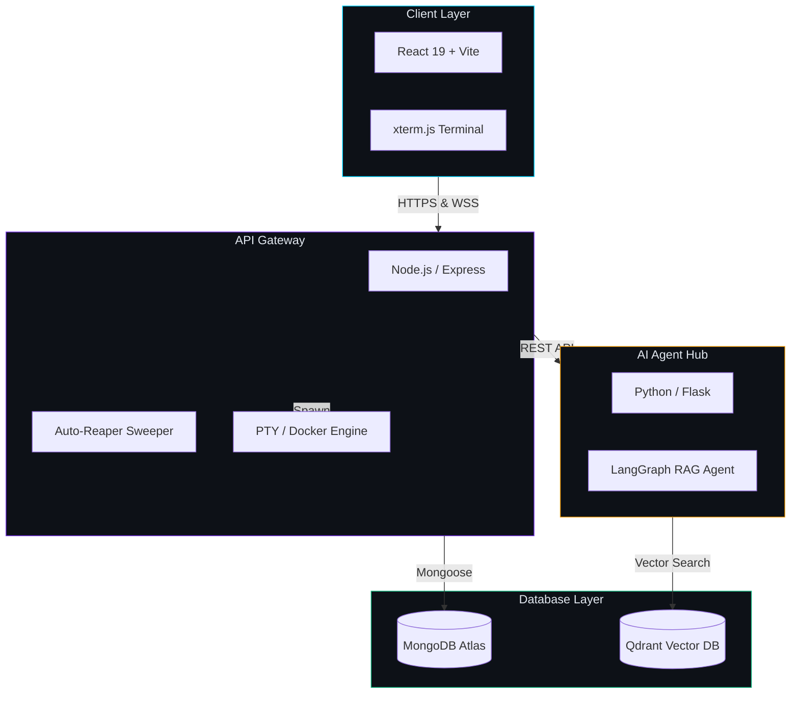

# 🚀 OpsAcademy — AI-Powered DevOps Learning Platform

> **Learn DevOps by Doing, Not Watching.**  
> An interactive, browser-based learning platform that bridges the gap between watching video tutorials and cracking real-world DevOps placement interviews.

---

## 💥 The Problem
Most engineering students get trapped in **"Tutorial Hell"** — watching 20-hour video courses without executing commands. When placed in front of a live Linux terminal or asked real-world architecture questions during placement interviews, **they freeze**.

## 💡 The Solution
OpsAcademy replaces passive video consumption with an interactive **3-Mode Learning Engine**:
1. 📖 **Learn Mode**: Interactive theory with real-world analogies & live Mermaid.js vector architecture diagrams.
2. 💻 **Practice Mode**: Step-by-step terminal instructions with automated verification guidelines & AI mentoring.
3. 🎯 **Prepare Mode**: Interactive 3D flip card decks and top recruiter model answer keys for campus placement drives.

---

## 🗺️ The Student Journey

```mermaid
graph LR
    A["🎓 Student Opens OpsAcademy"] --> B["📚 Chooses Course (e.g., Docker)"]
    B --> C["📖 Mode 1: Reads Theory & Mermaid Diagrams"]
    C --> D["🧩 Takes AI Concept Check Quiz"]
    D --> E["💻 Mode 2: Opens Practice Instructions"]
    E --> F["🤖 Asks AI Mentor for Contextual Hints"]
    F --> G["🏆 Mode 3: Attempts Placement Flashcards"]
    G --> H["✅ Progress Tracked & Placement Ready!"]
    
    style A fill:#0d1117,stroke:#00d4ff,color:#e2e8f0
    style C fill:#0d1117,stroke:#7c3aed,color:#e2e8f0
    style E fill:#0d1117,stroke:#f59e0b,color:#e2e8f0
    style G fill:#0d1117,stroke:#10b981,color:#e2e8f0
```



---

## 📊 Quantified Engineering Metrics

| Metric | Achievement | Impact |
|---|---|---|
| **Terminal Latency** | **<50ms** | Real-time WebSocket streaming (`xterm.js` → `node-pty`) |
| **Idle Infrastructure Cost** | **~90% Reduction** | Background Auto-Reaper service cleans up stale sandboxes |
| **Course Catalog** | **14 Courses** | Complete A-to-Z placement coverage (Linux → GitOps) |
| **AI Mentor Retrieval** | **Contextual RAG** | LangGraph multi-agent pipeline + Qdrant Vector DB |

---

## 🛠️ Architecture & Tech Stack



- **Frontend**: React 19, Vite, xterm.js, Vanilla CSS Glassmorphism
- **API Gateway**: Node.js, Express, `node-pty`, WebSockets, JWT, Mongoose
- **AI Agent Hub**: Python, Flask, LangGraph Multi-Agent RAG, Isolation Forest ML
- **Databases**: MongoDB Atlas (User Data & Progress), Qdrant Cloud (Vector RAG Embeddings)

---

## 🌟 14 Production-Grade Courses

- 🐧 **Linux Fundamentals**
- 🐙 **Git & GitHub Workflow**
- 🐳 **Docker Containers**
- ☸️ **Kubernetes Orchestration**
- 🌐 **Networking Fundamentals**
- ⚙️ **CI/CD Pipelines (GitHub Actions)**
- ☁️ **AWS Cloud Essentials**
- 📊 **Monitoring & Observability (Prometheus/Grafana)**
- 🏗️ **Terraform & Infrastructure as Code**
- 📐 **System Design & High Availability**
- 🛡️ **DevSecOps, OWASP API Security & SBOMs**
- 📜 **Advanced Bash Scripting & Automation**
- 🐍 **Python Cloud Automation (boto3)**
- 🐙 **GitOps & ArgoCD**

---

## 🚀 Quick Start (Local Development)

### 1. Clone the repository
```bash
git clone https://github.com/yashsrivastava1408/OpsAcademy.git
cd OpsAcademy
```

### 2. Install & Start Frontend
```bash
cd client
npm install
npm run dev
```

### 3. Start Backend API Gateway
```bash
cd ../server
npm install
npm start
```

Open `http://localhost:5173` in your browser!

---

## 📜 License & Author

Built with ❤️ for DevOps & Cloud engineering students preparing for campus placement drives.

- **Author**: Yash Srivastava
- **Live Demo**: [https://ops-academy-chi.vercel.app](https://ops-academy-chi.vercel.app)
- **License**: MIT
