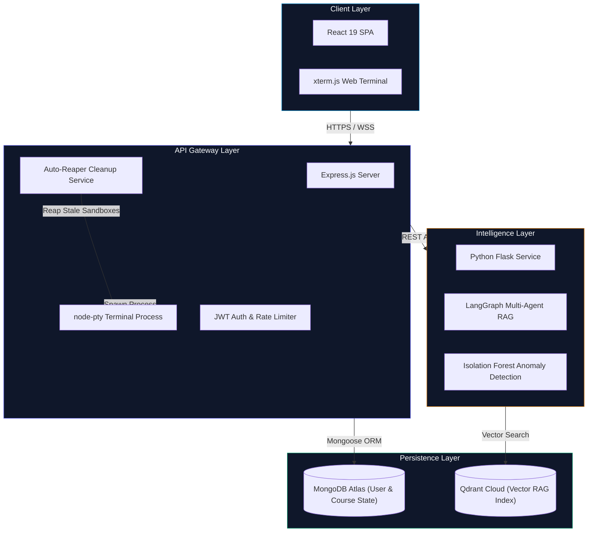
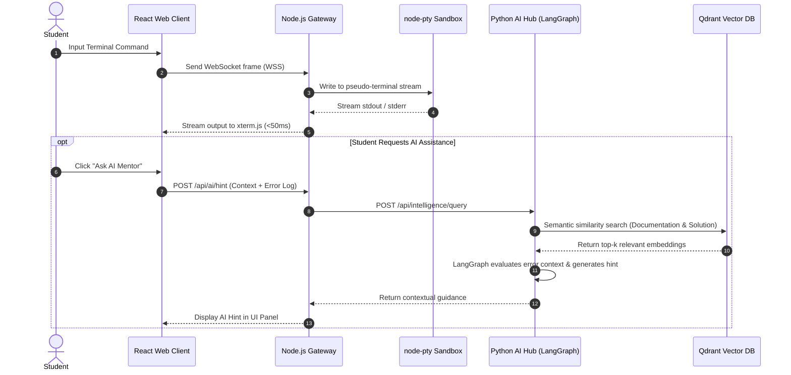
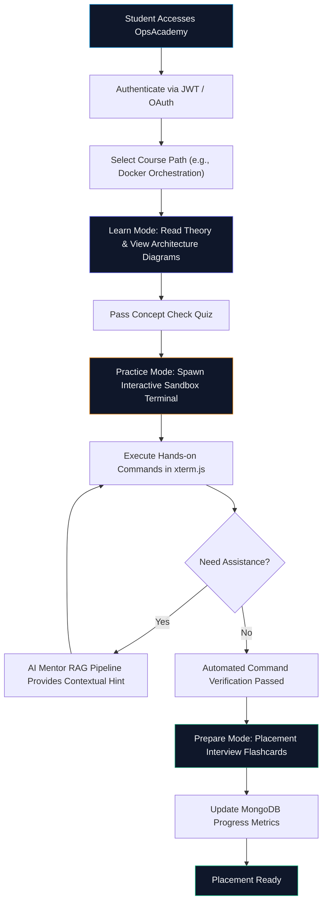

# OpsAcademy: Interactive DevOps & Cloud Engineering Learning Platform

An interactive, browser-based learning ecosystem designed to bridge the gap between theoretical knowledge and real-world DevOps execution. OpsAcademy integrates hands-on web terminal sandboxes, multi-agent AI mentoring, and placement-focused interview preparation.

---

## Table of Contents
- [Executive Overview](#executive-overview)
- [Screenshots & Demo](#screenshots--demo)
- [System Architecture](#system-architecture)
- [Multi-Agent AI Mentoring & Terminal Sequence](#multi-agent-ai-mentoring--terminal-sequence)
- [Student Learning Journey](#student-learning-journey)
- [Quantified Engineering Metrics](#quantified-engineering-metrics)
- [Production Course Catalog](#production-course-catalog)
- [Technology Stack](#technology-stack)
- [Local Installation & Development](#local-installation--development)
- [License & Authorship](#license--authorship)

---

## Executive Overview

OpsAcademy eliminates passive video consumption by enforcing a three-mode hands-on execution methodology:

1. **Learn Mode**: Concept breakdown featuring architecture diagrams, system analogies, and interactive vector visualizations.
2. **Practice Mode**: Step-by-step terminal execution in an isolated sandbox with real-time verification guidelines and contextual AI assistance.
3. **Prepare Mode**: Flashcard decks, recruiter evaluation rubrics, and model answer keys tailored for Cloud and DevOps placement interviews.

---

## Screenshots & Demo

| **Platform Dashboard** | **Course Catalog & 3-Mode Engine** |
| :---: | :---: |
|  
---

## System Architecture

OpsAcademy is built using a decoupled microservices architecture comprising a React frontend, a Node.js API Gateway managing PTY sandboxes and WebSockets, a Python Multi-Agent AI Hub, and persistent database layers.



---

## Multi-Agent AI Mentoring & Terminal Sequence

The sequence diagram below illustrates the end-to-end execution flow when a student interacts with the web terminal and requests AI assistance.



---

## Student Learning Journey



---

## Quantified Engineering Metrics

| Metric | Target / Benchmark | Implementation Detail |
| :--- | :--- | :--- |
| **Terminal Latency** | **<50ms** | Binary WebSocket streaming via `xterm.js` and `node-pty`. |
| **Idle Resource Efficiency** | **~90% Savings** | Background Auto-Reaper service reaps inactive pseudo-terminals. |
| **Curriculum Coverage** | **14 Paths** | Structured progression covering Linux, Kubernetes, Terraform, and GitOps. |
| **AI Retrieval Latency** | **<400ms** | Cached Qdrant vector retrieval combined with LangGraph agent routing. |

---

## Production Course Catalog

1. **Linux Fundamentals**: Kernel concepts, process management, file permissions, and shell navigation.
2. **Git & GitHub Workflow**: Branching strategies, interactive rebasing, merge conflict resolution, and PR workflows.
3. **Docker Containers**: Containerization mechanics, image optimization, multi-stage builds, and compose networking.
4. **Kubernetes Orchestration**: Pods, Deployments, Services, Ingress Controllers, ConfigMaps, and Secrets.
5. **Networking Fundamentals**: TCP/IP stack, DNS resolution, HTTP/S protocols, CIDR subnetting, and firewalls.
6. **CI/CD Pipelines**: Automated workflows using GitHub Actions, artifact management, and release tagging.
7. **AWS Cloud Essentials**: EC2, S3, IAM policies, VPC networking, and Security Groups.
8. **Monitoring & Observability**: Prometheus metrics collection, Grafana dashboard visualization, and Alertmanager.
9. **Terraform Infrastructure as Code**: Declarative provisioning, HCL syntax, state management, and module design.
10. **System Design & High Availability**: Load balancing, auto-scaling, disaster recovery, and fault tolerance.
11. **DevSecOps & Security**: Container vulnerability scanning, OWASP API security, and SBOM generation.
12. **Advanced Bash Scripting**: Automation scripts, error trapping, parsing CLI flags, and cron jobs.
13. **Python Cloud Automation**: Scripting AWS infrastructure management using `boto3` and REST SDKs.
14. **GitOps & ArgoCD**: Declarative continuous delivery, cluster state synchronization, and automated rollbacks.

---

## Technology Stack

- **Frontend**: React 19, Vite, xterm.js, Vanilla CSS Glassmorphism
- **API Gateway**: Node.js, Express, `node-pty`, WebSockets, JWT Authentication, Mongoose ORM
- **Intelligence Layer**: Python, Flask, LangGraph Multi-Agent RAG, Isolation Forest Anomaly Detection
- **Database Systems**: MongoDB Atlas (User State & Course Progress), Qdrant Cloud (Vector RAG Index)

---

## Local Installation & Development

### 1. Repository Clone
```bash
git clone https://github.com/yashsrivastava1408/OpsAcademy.git
cd OpsAcademy
```

### 2. Client Setup
```bash
cd client
npm install
npm run dev
```

### 3. API Gateway Setup
```bash
cd ../server
npm install
npm start
```

Access the client interface locally at `http://localhost:5173`.

---

## License & Authorship

- **Author**: Yash Srivastava
- **Live Platform**: [https://ops-academy-chi.vercel.app](https://ops-academy-chi.vercel.app)
- **License**: MIT
