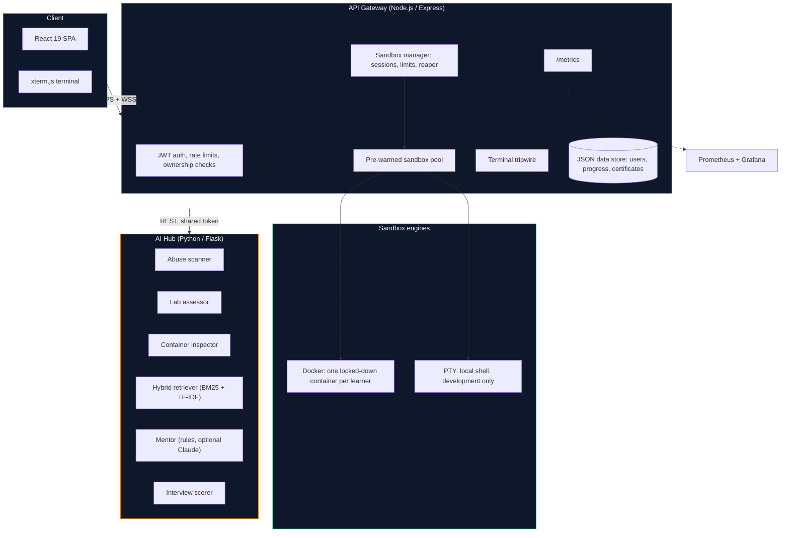
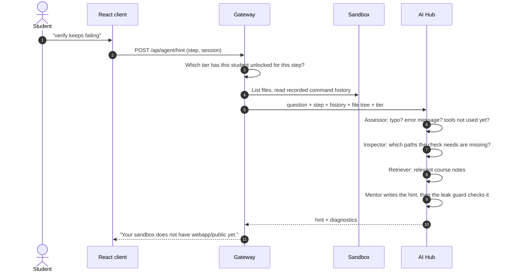

# OpsAcademy: Interactive DevOps & Cloud Engineering Learning Platform

Learn DevOps by doing it. OpsAcademy gives each learner a real Linux shell in the browser, checks their lab work automatically inside that sandbox, and has an AI mentor that looks at what they actually typed and created before giving a hint.

Every unit has three modes:

1. **Learn**: theory with diagrams and concept-check quizzes.
2. **Practice**: a step-by-step lab in a live sandbox, verified by running checks inside it.
3. **Prepare**: spaced-repetition flashcards and a mock interview scored against a rubric.

---

## Table of Contents
- [What it does](#what-it-does)
- [Screenshots & Demo](#screenshots--demo)
- [System Architecture](#system-architecture)
- [How a hint is produced](#how-a-hint-is-produced)
- [Measured numbers](#measured-numbers)
- [Sandbox security](#sandbox-security)
- [Course catalogue](#course-catalogue)
- [Technology stack](#technology-stack)
- [Running it](#running-it)
- [Tests and checks](#tests-and-checks)
- [Deploying](#deploying)
- [Limitations](#limitations)
- [License & Authorship](#license--authorship)

---

## What it does

- **Live terminal.** xterm.js in the browser, streamed over WebSocket to a per-learner sandbox. Sandboxes are pre-warmed so starting a lab does not wait for a container to boot.
- **Two sandbox engines behind one interface.** Docker containers for real isolation, or a local PTY shell for development.
- **Auto-verified labs.** 89 lab steps across 19 units. Each step has a check that runs inside the learner's sandbox; the check itself never reaches the browser.
- **A mentor that reads the sandbox.** Hints come in three tiers (nudge, diagnostic, syntax). The diagnostic tier names the files that are missing and the typo in the last command, because the gateway sends the hub the real file tree and command history.
- **Progress that is earned.** XP, streaks, per-unit progress and "focus areas" (units where checks failed or hints were needed) are recorded on the server from verified work.
- **Spaced repetition and mock interviews.** Flashcards are scheduled with SM-2. Written interview answers are scored against each question's key points, with the missed points listed.
- **Verifiable certificates.** Issued only for a unit completed through sandbox checks, signed with HMAC-SHA256, and checkable by anyone at `/verify/<certificate id>`.
- **Typing that stays instant on a slow link.** When the round trip to the sandbox is slow, typed characters are shown at once and corrected by the server's echo; the screen always ends up exactly as the server sent it. A dropped connection reconnects to the same sandbox.
- **Simulated Docker, Kubernetes and AWS labs.** The sandbox has no network and no container runtime, so these labs run against small simulators that say what they are; see [Measured numbers](#lab-content-npm-run-labsaudit-docker-sandbox).
- **Accounts that hold up.** Guest progress moves to the account on sign-up; password reset and email confirmation by one-time link; a reset signs out every older session; an optional public profile page; a lab of the day with a small XP bonus.
- **Works on a phone.** The lab switches between instructions and terminal on narrow screens.
- **Operations built in.** Prometheus metrics, a Grafana dashboard, alert rules, liveness and readiness probes, structured logs, graceful shutdown.
- **Operator page.** `/admin` shows running sandboxes, the warm pool, accounts and what is configured, and can stop a sandbox. It exists only when the server has an `ADMIN_TOKEN`.

---

## Screenshots & Demo

| **Platform Dashboard** |
| 

---

## System Architecture


```mermaid
graph TB
    subgraph Client["Client"]
        UI["React 19 SPA"]
        TERM["xterm.js terminal"]
    end

    subgraph Gateway["API Gateway (Node.js / Express)"]
        AUTH["JWT auth, rate limits, ownership checks"]
        MGR["Sandbox manager: sessions, limits, reaper"]
        POOL["Pre-warmed sandbox pool"]
        GUARD["Terminal tripwire"]
        STORE[("JSON data store: users, progress, certificates")]
        METRICS["/metrics"]
    end

    subgraph Engines["Sandbox engines"]
        DOCKER["Docker: one locked-down container per learner"]
        PTY["PTY: local shell, development only"]
    end

    subgraph Hub["AI Hub (Python / Flask)"]
        A0["Abuse scanner"]
        A1["Lab assessor"]
        A15["Container inspector"]
        A2["Hybrid retriever (BM25 + TF-IDF)"]
        A3["Mentor (rules, optional Claude)"]
        A4["Interview scorer"]
    end

    Client -->|HTTPS + WSS| Gateway
    MGR --> POOL
    POOL --> DOCKER
    POOL --> PTY
    Gateway -->|"REST, shared token"| Hub
    METRICS -.-> PROM["Prometheus + Grafana"]

    style Client fill:#0f172a,stroke:#0284c7,color:#f8fafc
    style Gateway fill:#0f172a,stroke:#6366f1,color:#f8fafc
    style Hub fill:#0f172a,stroke:#d97706,color:#f8fafc
    style Engines fill:#0f172a,stroke:#059669,color:#f8fafc
```

The gateway is the only service the browser talks to. It owns every session, so each sandbox, terminal connection and hint request is tied to one authenticated identity (a guest token is issued on first visit; registering upgrades it in place and keeps the progress).

---

## How a hint is produced


```mermaid
sequenceDiagram
    autonumber
    actor Student
    participant Web as React client
    participant API as Gateway
    participant Sbx as Sandbox
    participant AI as AI Hub

    Student->>Web: "verify keeps failing"
    Web->>API: POST /api/agent/hint (step, session)
    API->>API: Which tier has this student unlocked for this step?
    API->>Sbx: List files, read recorded command history
    API->>AI: question + step + history + file tree + tier
    AI->>AI: Assessor: typo? error message? tools not used yet?
    AI->>AI: Inspector: which paths the check needs are missing?
    AI->>AI: Retriever: relevant course notes
    AI->>AI: Mentor writes the hint, then the leak guard checks it
    AI-->>API: hint + diagnostics
    API-->>Web: "Your sandbox does not have webapp/public yet."
```

A student cannot jump to the strongest hint: each request unlocks one more tier for that step, and the number of hints used feeds the "focus areas" on the dashboard. If the hub is down, the gateway answers from the step's own instructions and says so.

The mentor works without any LLM. Setting `ANTHROPIC_API_KEY` on the hub switches hint writing to Claude; the rule-based hint remains the fallback when the call fails, is refused, or gives too much away for the tier.

The chat window receives the hint while it is being written (`POST /api/agent/hint/stream`, one JSON event per line, passed through the gateway). Streaming does not weaken the leak guard: the hub holds text back until the end of a sentence, and the whole hint so far must pass the guard before that sentence is released. If the model gives too much away, fails or stops early, the client is told to discard what it showed and gets the rule-based hint instead. If streaming is not available at all, the client falls back to the plain request above.

---

## Measured numbers

Everything here was measured by a script in this repository, on an Apple-silicon MacBook with Docker Desktop, over localhost. There is no network latency in these figures, and they will differ on other machines. Rerun the scripts to get your own.

### Page weight (`npm run build` in `client/`)

Each page is loaded on demand, so the terminal and diagram libraries are only downloaded by the pages that use them.

| What the browser downloads | Minified | Gzipped |
| :--- | ---: | ---: |
| App shell, needed by every page (React, router, API client, navbar) | 297 kB | 98 kB |
| Landing page | 55 kB | 21 kB |
| Dashboard | 23 kB | 8 kB |
| Lesson page (the diagram library is fetched only if the lesson has a diagram) | 15 kB | 5 kB |
| Practice lab (includes xterm.js) | 374 kB | 97 kB |
| All styles | 87 kB | 16 kB |

Before pages were split, every visitor downloaded one 902 kB script (264 kB gzipped) whichever page they opened.

### Sandbox and terminal (`server/scripts/benchmark.js`, 15 sandboxes)

| What the learner waits for | Docker mode | PTY mode |
| :--- | :--- | :--- |
| Start a sandbox, pool hit | p50 2.1 ms, p95 3.7 ms | p50 2.4 ms, p95 3.6 ms |
| Start a sandbox, cold (pool off) | p50 164 ms, p95 662 ms | p50 3.3 ms, p95 4.7 ms |
| Connect until the shell prints | p50 52 ms, p95 67 ms | p50 2.8 ms, p95 10 ms |
| Keystroke until its echo | p50 0.4 ms, p95 1.3 ms | p50 0.2 ms, p95 0.4 ms |

The pool is what removes the container cold start: 164 ms down to 2 ms at the median.

### AI hub (`ai-hub/evals/run_eval.py`)

| Measure | Result |
| :--- | :--- |
| Hints that give away more than their tier allows | 0 of 2,403 (every step, every tier, three sandbox states) |
| Stuck-student scenarios handled as expected | 36 of 36 |
| Hostile commands blocked by the rules | 31 of 31, including base64-wrapped ones |
| Course commands wrongly blocked | 0 of 350 |
| Anomaly model: held-out course commands flagged | 1.7% |
| Anomaly model: hostile commands no rule covers | 3 of 10 flagged |
| Interview scorer (rules): model answer / half of it / off-topic | 92 / 64 / 6 out of 100, in that order for all 45 questions |

Retrieval, on 53 labelled questions with no unit hint given:

| | Lexical only (BM25 + character n-grams) | With the embedding ranker added |
| :--- | ---: | ---: |
| Right unit ranked first | 84.9% | 94.3% |
| Right unit in the top 3 | 94.3% | 98.1% |
| Right section ranked first | 54.9% | 60.8% |
| Right section in the top 3 | 74.5% | 92.2% |
| Time to produce a hint (rule-based, uncached) | p50 1.3 ms | p50 3.4 ms |
| Hub memory | about 125 MB | about 580 MB in a container |

The embedding ranker is a small local model (`all-MiniLM-L6-v2` through ONNX, no API key). It is optional: `pip install -r ai-hub/requirements-semantic.txt`, or the hub's Docker image, which includes it and the model file. Without it the hub uses the lexical column. The Render blueprint turns it off because the free plan does not have the memory.

Interview answers phrased differently from the rubric (`evals/interview_paraphrases.json`: 12 questions, each with a correct answer in other words and a confident answer that is wrong):

| Scorer | Correct, reworded | Confident and wrong | Correct scores higher |
| :--- | ---: | ---: | ---: |
| Rules (word matching), the default | 21 / 100 | 13 / 100 | 11 of 12 pairs |
| Sentence embeddings, tried and **not shipped** | similarity 0.55 | similarity 0.53 | 7 of 12 pairs |
| LLM judge (when the hub has an API key) | not measured | not measured | not measured |

The rules never pass a wrong answer, but they also fail every correct answer that avoids the rubric's wording. Embeddings were the obvious fix and the measurement rules them out: they score a wrong answer about the right topic almost as close to the model answer as a correct one, so they would give marks for mistakes. Judging correctness needs a language model, so with an LLM configured the hub asks it which rubric points the answer conveys and which statements are wrong, and computes the score from that verdict. `python evals/run_eval.py --llm` fills in the last row; it has not been run because this machine has no API key.

How to read these: the scenarios, retrieval questions and paraphrases were written alongside the code, so they are a regression suite, not an independent benchmark. The anomaly model is weak, which is why it only flags and never blocks. The LLM paths (mentor and answer judge) have unit tests with a stub client but have not been scored against a live model.

### Under load (`server/scripts/loadtest.js`, 25 students for 60 seconds)

Each simulated student starts a sandbox, types at about 8 characters a second, runs commands, verifies a lab step, asks for a hint, and keeps the page's background polling going. 25 is the gateway's default limit on sandboxes.

| What a student waits for | PTY sandboxes (p50 / p95 / p99) | Docker sandboxes (p50 / p95 / p99) |
| :--- | ---: | ---: |
| Keystroke to echo | 1.4 / 2 / 5 ms | 2.1 / 10 / 32 ms |
| Enter to command output | 2.6 / 9 / 19 ms | 2.5 / 12 / 27 ms |
| Verify a lab step | 7 / 13 / 40 ms | 49 / 77 / 111 ms |
| Mentor hint (rule-based) | 49 / 111 / 111 ms | 65 / 98 / 140 ms |
| Inspector refresh | 50 / 62 / 118 ms | 59 / 124 / 339 ms |
| Start a sandbox | 3.5 / 7 / 9 ms | 3.8 / 19 / 288 ms |

Both runs: about 10,000 keystrokes, 300 commands and 830 HTTP requests, 0 errors, 0 sandboxes left behind. The gateway used 6% (PTY) and 10% (Docker) of one CPU core and 75 to 90 MB of memory.

An earlier Docker run was much worse at the tail (inspector refresh p95 10.5 s, keystroke p99 1 s). Two things changed before the run above: the inspector now gathers its snapshot with one command per poll instead of three, and a Docker image build that was running in the background had finished. The two were not measured separately, so do not read the improvement as coming from the code change alone.

How to read these: everything is on one laptop over localhost, so there is no network latency, and the load generator shares the CPU with the gateway and the sandboxes. It shows the gateway is not the bottleneck at its own limit of 25. It says nothing about more than 25 students, a small cloud instance, or hours of use.

### Lab content (`npm run labs:audit`, Docker sandbox)

| | Steps |
| :--- | :--- |
| Can be done in the sandbox, with a check that fails until the work is done | 89 of 89 |
| Need a tool the sandbox does not have | 0 |
| Have a check that already passes on an empty sandbox | 0 |

The sandbox has no network and cannot run a container runtime, a cluster or a cloud account. So the Docker, Kubernetes and AWS labs run against **simulators** (`sandbox-image/bin/docker`, `kubectl`, `aws`): small Python programs that keep state per student, print output shaped like the real tools, and say they are simulators in `docker info`, `kubectl cluster-info` and `aws --version`. `docker run -d -p $WEB_PORT:80 nginx` starts a real local web server, so `curl localhost:$WEB_PORT` answers. Every sandbox has `$WEB_PORT`, `$APP_PORT` and `$SITE_PORT` set: 8080, 9090 and 8000 in a container, and a private block of ports per shell in PTY mode, where all shells share one machine. The networking lab uses loopback only. Each rewritten check is tested both ways, failing on an empty sandbox and passing after the tasks are done, on macOS and inside the hardened container (`python -m pytest sandbox-image/tests`).

--- | :--- |
| Can be done in the sandbox, with a check that fails until the work is done | 66 of 89 |
| Need a tool the sandbox does not have (`docker`, `kubectl`, `aws`, `terraform`, `dig`, `tracepath`) | 20 |
| Have a check that already passes on an empty sandbox | 7 |

Ten units are fully sound. The Docker, Kubernetes and AWS labs need a daemon, a cluster or a cloud account that a locked-down container does not have; see [Limitations](#limitations).

---

## Sandbox security

In Docker mode each learner gets a container that runs as an unprivileged user with every capability dropped, a read-only root filesystem, no network, and caps on memory (256 MB), CPU (0.5), processes (128) and disk (64 MB of tmpfs). `server/scripts/docker-check.js` tries to break each of these from inside a real container (23 checks) and runs in CI.

Sandboxes are bound to the identity that started them: the terminal WebSocket is refused before upgrade unless the token owns the session, and every REST route answers 404 for someone else's sandbox. A reaper destroys sandboxes after 15 idle minutes or 30 minutes in total.

A tripwire at the terminal blocks fork bombs, `rm -rf /`, miners, reverse shells and escape attempts, and ends the session after three strikes. It is a courtesy and an audit trail, not the boundary: the container limits are.

**PTY mode has no isolation.** It is a shell as the gateway's own user and is meant for local development.

The full list of attacks, controls, how each is checked, and the gaps that remain is in [docs/THREAT_MODEL.md](docs/THREAT_MODEL.md).

---

## Course catalogue

19 units, 89 lab steps. Each unit has Learn, Practice and Prepare content.

| Unit | Level | Lab steps |
| :--- | :--- | :--- |
| Linux Fundamentals | beginner | 7 |
| Git & GitHub Workflow | beginner | 6 |
| Advanced Shell & Bash Automation | beginner | 6 |
| Networking Fundamentals | beginner | 4 |
| Docker Fundamentals | intermediate | 6 |
| CI/CD Pipelines | intermediate | 3 |
| Cloud Computing (AWS) | intermediate | 3 |
| Terraform & Infrastructure as Code | intermediate | 5 |
| Python for Cloud & DevOps Automation | intermediate | 5 |
| DevSecOps & Cloud Security | intermediate | 6 |
| Kubernetes Orchestration | advanced | 6 |
| Monitoring & Observability | advanced | 5 |
| System Design & Scalability | advanced | 5 |
| GitOps & Progressive Delivery (ArgoCD) | advanced | 5 |
| SRE Incident Response & Chaos Engineering | advanced | 4 |
| Cloud-Native Container & Linux Kernel Hardening | advanced | 4 |
| Digital Forensics & Incident Response | advanced | 3 |
| Enterprise Endpoint Security: EPP, EDR & XDR | advanced | 3 |
| Enterprise DevOps case study: GitOps, CI/CD & K8s post-mortem | advanced | 3 |

Units are plain JSON under `server/data/units/`. Adding one needs no code: see [docs/LAB_AUTHORING.md](docs/LAB_AUTHORING.md).

---

## Technology stack

- **Frontend**: React 19, Vite, xterm.js, React Router, plain CSS
- **API gateway**: Node.js 22, Express, `ws`, `node-pty`, `dockerode`, JWT, bcrypt, helmet, express-rate-limit, pino, prom-client
- **AI hub**: Python 3.11, Flask, gunicorn, scikit-learn (TF-IDF, Isolation Forest), a small BM25 implementation, optional sentence embeddings (fastembed, ONNX), optional Anthropic SDK
- **Storage**: one JSON file with atomic writes by default, or SQLite (`STORE_DRIVER=sqlite`, the one built into Node), behind the same small store interface
- **Testing**: Jest and supertest (311 tests), pytest (316 for the AI hub, 97 for the lab simulators), an end-to-end script that plays a learner over HTTP and WebSocket (56 checks), and Playwright browser tests (120 checks, including typing on a slow connection and a phone-sized screen)
- **Operations**: Docker Compose, Kubernetes manifests, Prometheus, Grafana, GitHub Actions

There is no MongoDB, vector database or agent framework in this project. Retrieval is lexical with an optional embedding ranker held in memory, and the "agents" are plain Python classes called in order.

---

## Running it

### Local development (PTY sandboxes)

Three terminals. Node 22 and Python 3.10 or newer.

```bash
# 1. AI hub (port 5005)
cd ai-hub
pip install -r requirements.txt
python app.py

# 2. API gateway (port 4000)
cd server
cp .env.example .env        # then set JWT_SECRET
npm install
npm run dev

# 3. Client (port 5173)
cd client
npm install
npm run dev
```

Open `http://localhost:5173`. In this mode the "sandbox" is a shell on your own machine in a scratch folder.

### Full stack with Docker sandboxes

```bash
export JWT_SECRET=$(openssl rand -hex 48) AI_HUB_TOKEN=$(openssl rand -hex 24)
docker compose build
docker compose up -d
# with Prometheus (:9090) and Grafana (:3000):
docker compose --profile observability up -d
```

Open `http://localhost:5173`. The gateway starts one locked-down container per learner through the host's Docker socket.

### Optional LLM mentor

Set `ANTHROPIC_API_KEY` for the hub and raise `AI_HUB_TIMEOUT_MS` on the gateway to about 15000. `LLM_MODEL` and `LLM_EFFORT` are in `ai-hub/.env.example`.

---

## Tests and checks

```bash
cd server
npm run lint                              # oxlint
npm test                                  # 311 tests, including real shells over node-pty
npm run test:coverage                     # the same, and fails under the coverage floor in package.json
npm audit --omit=dev --audit-level=high   # known vulnerabilities in what ships
npm run labs:validate                     # structure of every unit
npm run labs:audit                        # every check against an empty Docker sandbox (labs:audit:check exits 1 on a finding)
node scripts/docker-check.js              # try to break out of a real sandbox container
node scripts/e2e.js http://localhost:4000 # a learner's whole journey, against a running stack
node scripts/benchmark.js http://localhost:4000
node scripts/loadtest.js http://localhost:4000 --students 25 --seconds 60

cd ../ai-hub
pip install -r requirements-dev.txt
ruff check . ../sandbox-image             # lint (rules in ruff.toml at the repository root)
python -m pytest tests -q                 # 316 tests (add --cov=agents --cov=app --cov=pipeline for coverage)
python evals/run_eval.py --check          # quality gates, also run in CI
pip-audit -r requirements.txt             # known vulnerabilities in the hub's packages

cd ..
python -m pytest sandbox-image/tests -q   # 97 tests: the lab simulators and every rewritten lab check

cd client
npm run lint && npm test && npm run build
npm run e2e                               # real browser against a throwaway stack (needs: npx playwright install chromium)
```

### Continuous integration

`.github/workflows/ci.yml` runs on every push and pull request to `main`:

| Job | What fails the build |
| :--- | :--- |
| Gateway | lint (oxlint), any of the 311 tests, coverage under the floor (85% statements, 77% branches; today 89% and 82%), malformed lab content |
| AI hub | lint (ruff), any test, coverage under 90% (today 97%), the course index out of date, the lab simulator tests, or a quality gate: an answer leak in any of 2,403 hints, a retrieval or scanner regression, a stuck-student case |
| Client | lint, the local-echo unit tests, the production build |
| Security | a high or critical vulnerability in what ships (`npm audit`, `pip-audit`), a secret anywhere in the history (gitleaks). Infrastructure files are scanned for risky settings and reported, not gated |
| Browser | any of the 120 browser checks; screenshots and server logs are kept for a week when it fails |
| Docker | a critical, fixable vulnerability in any of the four images (Trivy), a sandbox break-out check, a lab step that cannot be done or passes without work (all 89, in a real container), the simulator tests inside the hardened container, the end-to-end journey |
| Deploy | runs only on `main`, only after every job above passed |

`codeql.yml` adds weekly and per-change code scanning for the JavaScript and Python source, and `dependabot.yml` opens weekly pull requests for outdated packages, base images and the pinned actions. Every third-party action is pinned to a commit hash.

Two honest notes. Most of this was added after the workflow last ran on GitHub, so until the first green run it is checked only by a workflow linter (`actionlint`) and by running the same commands locally. And the deploy job does nothing until you give it deploy hooks (see [Deploying](#deploying)); until then Render and Vercel still deploy every push on their own.

---

## Deploying

- **Client (Vercel or any static host).** Set `VITE_API_URL` to the gateway's public URL at build time. It is compiled into the bundle and into the page's Content-Security-Policy; without it the browser will only talk to `localhost:4000`.
- **Gateway.** Needs `JWT_SECRET` (it refuses to start in production without one). Set `CORS_ORIGINS` to the client's URL, and `DATA_DIR` to a persistent disk if accounts and certificates should survive restarts.
- **Put the gateway near its students.** Every terminal keystroke is a round trip to it. Measured from India, a gateway in Render's Oregon region took 0.3 to 1.1 s to answer a trivial request. Local echo hides that for typing, but command output still waits for the network.
- **Render (`render.yaml`).** A demo deployment: sandboxes are PTY shells inside the gateway's container, and the free plan has no persistent disk. The blueprint asks for the Singapore region. Render cannot move an existing service, so changing region means creating new services from the blueprint and pointing `VITE_API_URL` at the new URL.
- **Deploying only what passed CI.** By default Render and Vercel deploy every push to `main`, whether or not the checks passed. To gate it: create a Deploy Hook for each service (Render: service Settings, Deploy Hook; Vercel: project Settings, Git, Deploy Hooks), save the three URLs as repository secrets named `RENDER_HUB_DEPLOY_HOOK`, `RENDER_GATEWAY_DEPLOY_HOOK` and `VERCEL_DEPLOY_HOOK`, then switch off auto-deploy in Render and Vercel. The `deploy` job in CI then triggers them after every other job is green.
- **A VM with Docker (`docker-compose.yml`).** The setup to use for real learners.
- **Kubernetes (`k8s/`).** Runs the gateway unprivileged with PTY sandboxes inside the pod; a demo, for the same reason as Render. Create the secret from `k8s/secret.example.yaml` first.

Optional gateway settings (all in `server/.env.example`):

| Variable | What it turns on | Without it |
| :--- | :--- | :--- |
| `STORE_DRIVER=sqlite` | One database row per document, in `DATA_DIR/store.db`. An existing `store.json` is imported on first start. | One JSON file, rewritten on every save |
| `RESEND_API_KEY`, `MAIL_FROM` | Password-reset and confirmation emails are really sent | Links are only written to the server log |
| `APP_URL` | The web app's address, used to build the links in those emails | `CLIENT_URL`, else `http://localhost:5173` |
| `ADMIN_TOKEN` | The operator page at `/admin` and the `/api/admin` endpoints | Those endpoints answer 404 |
| `METRICS_TOKEN` | A bearer token on `/metrics` | `/metrics` is open |
| `DAILY_CHALLENGE=off` | Removes the lab of the day | It is on |

On the AI hub, `ANTHROPIC_API_KEY` switches hint writing and interview scoring to Claude; raise `AI_HUB_TIMEOUT_MS` on the gateway to about 15000 when you set it. `SEMANTIC_SEARCH=off` keeps the hub on lexical retrieval even when the embedding package is installed.

---

## Limitations

- **The Docker, Kubernetes and AWS labs use simulators, not the real tools.** They cover the commands the labs teach and refuse anything else with a clear message. They teach the workflow and the output; they are not a cluster.
- **PTY mode is not a sandbox.** Do not expose it to people you do not trust. (Each PTY shell does get its own block of ports for the labs, so students no longer collide on `-p 8080:80`; that is convenience, not isolation.)
- **One gateway process.** Sessions live in memory, and both stores (JSON file or SQLite) belong to a single process. Running several replicas needs a network database and an async store interface.
- **Email is not sent unless `RESEND_API_KEY` is set.** Without it, password-reset and confirmation links are only written to the server log (and returned by the API outside production so the flow can be tried). The Resend path has never been run against the real service.
- **Typing lag depends on where the gateway runs.** Every keystroke is a round trip. Local echo hides it when the round trip is over 50 ms, but output still arrives at network speed; deploy the gateway near its students.
- **Section-level retrieval is still imperfect.** With the embedding ranker the right section is ranked first only 61% of the time (in the top 3: 92%). Without it, on a small host, it is 55% and 75%.
- **The default interview scorer matches words, not meaning.** A correct answer phrased differently from the key points scores about 21 out of 100. The fix that works is the LLM judge, which needs an API key and has not been measured against a live model. Embeddings were measured and do not fix it.
- **The LLM mentor is untested against a live model**, including streamed answers. Its request shape, the leak check on streamed text and every failure path are tested with stand-ins.
- **Load tested only up to its own limit, on one laptop.** 25 students for a minute, over localhost. More students, a small cloud instance and long runs are unmeasured.

---

## License & Authorship

- **Author**: Yash Srivastava
- **Live Platform**: [https://ops-academy-chi.vercel.app](https://ops-academy-chi.vercel.app)
- **License**: MIT
