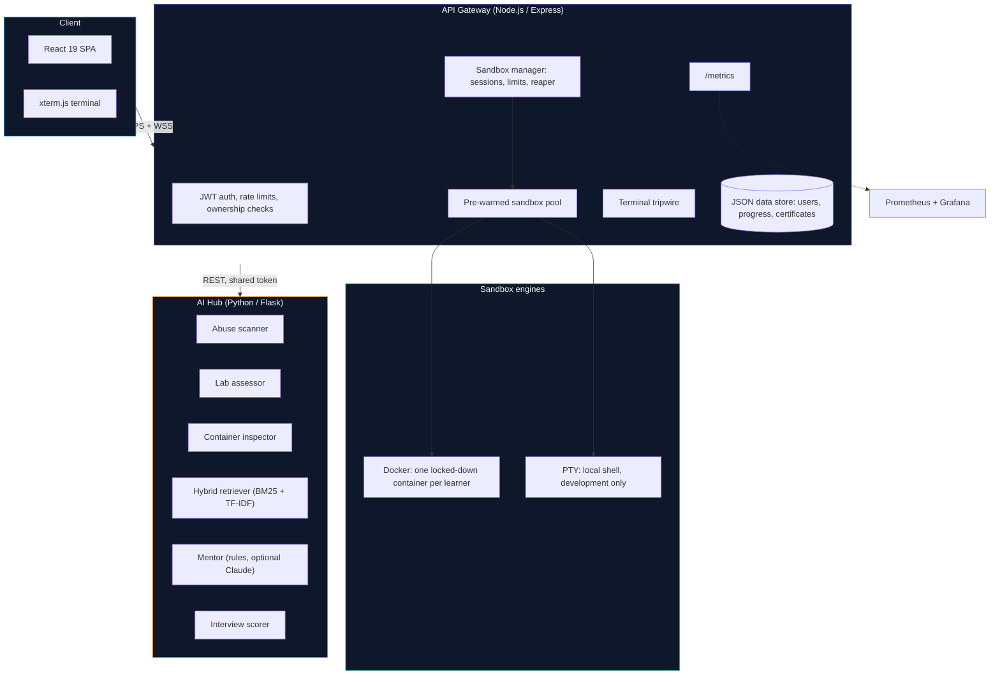
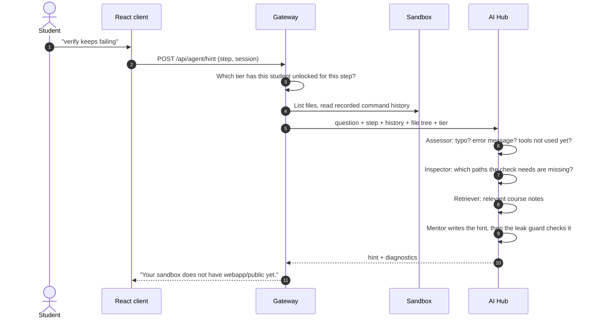

# OpsAcademy: Interactive DevOps & Cloud Engineering Learning Platform

Learn DevOps by doing it. OpsAcademy gives each learner a real Linux shell in the browser, checks their lab work automatically inside that sandbox, and has an AI mentor that looks at what they actually typed and created before giving a hint.

Every unit has three modes:

1. **Learn**: theory with diagrams and concept-check quizzes.
2. **Practice**: a step-by-step lab in a live sandbox, verified by running checks inside it.
3. **Prepare**: spaced-repetition flashcards and a mock interview scored against a rubric.

---

## Table of Contents
- [What it does](#what-it-does)
- [Screenshots & Demo](#screenshots--demo)
- [System Architecture](#system-architecture)
- [How a hint is produced](#how-a-hint-is-produced)
- [Measured numbers](#measured-numbers)
- [Sandbox security](#sandbox-security)
- [Course catalogue](#course-catalogue)
- [Technology stack](#technology-stack)
- [Running it](#running-it)
- [Tests and checks](#tests-and-checks)
- [Deploying](#deploying)
- [Limitations](#limitations)
- [License & Authorship](#license--authorship)

---

## What it does

- **Live terminal.** xterm.js in the browser, streamed over WebSocket to a per-learner sandbox. Sandboxes are pre-warmed so starting a lab does not wait for a container to boot.
- **Two sandbox engines behind one interface.** Docker containers for real isolation, or a local PTY shell for development.
- **Auto-verified labs.** 89 lab steps across 19 units. Each step has a check that runs inside the learner's sandbox; the check itself never reaches the browser.
- **A mentor that reads the sandbox.** Hints come in three tiers (nudge, diagnostic, syntax). The diagnostic tier names the files that are missing and the typo in the last command, because the gateway sends the hub the real file tree and command history.
- **Progress that is earned.** XP, streaks, per-unit progress and "focus areas" (units where checks failed or hints were needed) are recorded on the server from verified work.
- **Spaced repetition and mock interviews.** Flashcards are scheduled with SM-2. Written interview answers are scored against each question's key points, with the missed points listed.
- **Verifiable certificates.** Issued only for a unit completed through sandbox checks, signed with HMAC-SHA256, and checkable by anyone at `/verify/<certificate id>`.
- **Operations built in.** Prometheus metrics, a Grafana dashboard, alert rules, liveness and readiness probes, structured logs, graceful shutdown.

---

## Screenshots & Demo

| **Platform Dashboard** |
| 

---

## System Architecture


```mermaid
graph TB
    subgraph Client["Client"]
        UI["React 19 SPA"]
        TERM["xterm.js terminal"]
    end

    subgraph Gateway["API Gateway (Node.js / Express)"]
        AUTH["JWT auth, rate limits, ownership checks"]
        MGR["Sandbox manager: sessions, limits, reaper"]
        POOL["Pre-warmed sandbox pool"]
        GUARD["Terminal tripwire"]
        STORE[("JSON data store: users, progress, certificates")]
        METRICS["/metrics"]
    end

    subgraph Engines["Sandbox engines"]
        DOCKER["Docker: one locked-down container per learner"]
        PTY["PTY: local shell, development only"]
    end

    subgraph Hub["AI Hub (Python / Flask)"]
        A0["Abuse scanner"]
        A1["Lab assessor"]
        A15["Container inspector"]
        A2["Hybrid retriever (BM25 + TF-IDF)"]
        A3["Mentor (rules, optional Claude)"]
        A4["Interview scorer"]
    end

    Client -->|HTTPS + WSS| Gateway
    MGR --> POOL
    POOL --> DOCKER
    POOL --> PTY
    Gateway -->|"REST, shared token"| Hub
    METRICS -.-> PROM["Prometheus + Grafana"]

    style Client fill:#0f172a,stroke:#0284c7,color:#f8fafc
    style Gateway fill:#0f172a,stroke:#6366f1,color:#f8fafc
    style Hub fill:#0f172a,stroke:#d97706,color:#f8fafc
    style Engines fill:#0f172a,stroke:#059669,color:#f8fafc
```

The gateway is the only service the browser talks to. It owns every session, so each sandbox, terminal connection and hint request is tied to one authenticated identity (a guest token is issued on first visit; registering upgrades it in place and keeps the progress).

---

## How a hint is produced


```mermaid
sequenceDiagram
    autonumber
    actor Student
    participant Web as React client
    participant API as Gateway
    participant Sbx as Sandbox
    participant AI as AI Hub

    Student->>Web: "verify keeps failing"
    Web->>API: POST /api/agent/hint (step, session)
    API->>API: Which tier has this student unlocked for this step?
    API->>Sbx: List files, read recorded command history
    API->>AI: question + step + history + file tree + tier
    AI->>AI: Assessor: typo? error message? tools not used yet?
    AI->>AI: Inspector: which paths the check needs are missing?
    AI->>AI: Retriever: relevant course notes
    AI->>AI: Mentor writes the hint, then the leak guard checks it
    AI-->>API: hint + diagnostics
    API-->>Web: "Your sandbox does not have webapp/public yet."
```

A student cannot jump to the strongest hint: each request unlocks one more tier for that step, and the number of hints used feeds the "focus areas" on the dashboard. If the hub is down, the gateway answers from the step's own instructions and says so.

The mentor works without any LLM. Setting `ANTHROPIC_API_KEY` on the hub switches hint writing to Claude; the rule-based hint remains the fallback when the call fails, is refused, or gives too much away for the tier.

---

## Measured numbers

Everything here was measured by a script in this repository, on an Apple-silicon MacBook with Docker Desktop, over localhost. There is no network latency in these figures, and they will differ on other machines. Rerun the scripts to get your own.

### Page weight (`npm run build` in `client/`)

Each page is loaded on demand, so the terminal and diagram libraries are only downloaded by the pages that use them.

| What the browser downloads | Minified | Gzipped |
| :--- | ---: | ---: |
| App shell, needed by every page (React, router, API client, navbar) | 297 kB | 98 kB |
| Landing page | 55 kB | 21 kB |
| Dashboard | 23 kB | 8 kB |
| Lesson page (the diagram library is fetched only if the lesson has a diagram) | 15 kB | 5 kB |
| Practice lab (includes xterm.js) | 374 kB | 97 kB |
| All styles | 87 kB | 16 kB |

Before pages were split, every visitor downloaded one 902 kB script (264 kB gzipped) whichever page they opened.

### Sandbox and terminal (`server/scripts/benchmark.js`, 15 sandboxes)

| What the learner waits for | Docker mode | PTY mode |
| :--- | :--- | :--- |
| Start a sandbox, pool hit | p50 2.1 ms, p95 3.7 ms | p50 2.4 ms, p95 3.6 ms |
| Start a sandbox, cold (pool off) | p50 164 ms, p95 662 ms | p50 3.3 ms, p95 4.7 ms |
| Connect until the shell prints | p50 52 ms, p95 67 ms | p50 2.8 ms, p95 10 ms |
| Keystroke until its echo | p50 0.4 ms, p95 1.3 ms | p50 0.2 ms, p95 0.4 ms |

The pool is what removes the container cold start: 164 ms down to 2 ms at the median.

### AI hub (`ai-hub/evals/run_eval.py`)

| Measure | Result |
| :--- | :--- |
| Hints that give away more than their tier allows | 0 of 2,403 (every step, every tier, three sandbox states) |
| Stuck-student scenarios handled as expected | 36 of 36 |
| Retrieval, right unit in the top 3 (no unit hint given) | 94.3% of 53 questions (top 1: 84.9%) |
| Retrieval, right section in the top 3 | 74.5% (top 1: 54.9%) |
| Hostile commands blocked by the rules | 31 of 31, including base64-wrapped ones |
| Course commands wrongly blocked | 0 of 333 |
| Anomaly model: held-out course commands flagged | 1.8% |
| Anomaly model: hostile commands no rule covers | 3 of 10 flagged |
| Interview scorer: model answer / half of it / off-topic | 92 / 64 / 6 out of 100, in that order for all 45 questions |
| Time to produce a hint (rule-based, uncached) | p50 1.4 ms, p95 1.5 ms |

How to read these: the scenarios and retrieval questions were written alongside the code, so they are a regression suite, not an independent benchmark. The anomaly model is weak, which is why it only flags and never blocks. Section-level retrieval is mediocre; it is lexical (no embeddings). The LLM path has unit tests with a stub client but has not been scored against a live model.

### Lab content (`npm run labs:audit`, Docker sandbox)

| | Steps |
| :--- | :--- |
| Can be done in the sandbox, with a check that fails until the work is done | 66 of 89 |
| Need a tool the sandbox does not have (`docker`, `kubectl`, `aws`, `terraform`, `dig`, `tracepath`) | 20 |
| Have a check that already passes on an empty sandbox | 7 |

Ten units are fully sound. The Docker, Kubernetes and AWS labs need a daemon, a cluster or a cloud account that a locked-down container does not have; see [Limitations](#limitations).

---

## Sandbox security

In Docker mode each learner gets a container that runs as an unprivileged user with every capability dropped, a read-only root filesystem, no network, and caps on memory (256 MB), CPU (0.5), processes (128) and disk (64 MB of tmpfs). `server/scripts/docker-check.js` tries to break each of these from inside a real container (23 checks) and runs in CI.

Sandboxes are bound to the identity that started them: the terminal WebSocket is refused before upgrade unless the token owns the session, and every REST route answers 404 for someone else's sandbox. A reaper destroys sandboxes after 15 idle minutes or 30 minutes in total.

A tripwire at the terminal blocks fork bombs, `rm -rf /`, miners, reverse shells and escape attempts, and ends the session after three strikes. It is a courtesy and an audit trail, not the boundary: the container limits are.

**PTY mode has no isolation.** It is a shell as the gateway's own user and is meant for local development.

The full list of attacks, controls, how each is checked, and the gaps that remain is in [docs/THREAT_MODEL.md](docs/THREAT_MODEL.md).

---

## Course catalogue

19 units, 89 lab steps. Each unit has Learn, Practice and Prepare content.

| Unit | Level | Lab steps |
| :--- | :--- | :--- |
| Linux Fundamentals | beginner | 7 |
| Git & GitHub Workflow | beginner | 6 |
| Advanced Shell & Bash Automation | beginner | 6 |
| Networking Fundamentals | beginner | 4 |
| Docker Fundamentals | intermediate | 6 |
| CI/CD Pipelines | intermediate | 3 |
| Cloud Computing (AWS) | intermediate | 3 |
| Terraform & Infrastructure as Code | intermediate | 5 |
| Python for Cloud & DevOps Automation | intermediate | 5 |
| DevSecOps & Cloud Security | intermediate | 6 |
| Kubernetes Orchestration | advanced | 6 |
| Monitoring & Observability | advanced | 5 |
| System Design & Scalability | advanced | 5 |
| GitOps & Progressive Delivery (ArgoCD) | advanced | 5 |
| SRE Incident Response & Chaos Engineering | advanced | 4 |
| Cloud-Native Container & Linux Kernel Hardening | advanced | 4 |
| Digital Forensics & Incident Response | advanced | 3 |
| Enterprise Endpoint Security: EPP, EDR & XDR | advanced | 3 |
| Enterprise DevOps case study: GitOps, CI/CD & K8s post-mortem | advanced | 3 |

Units are plain JSON under `server/data/units/`. Adding one needs no code: see [docs/LAB_AUTHORING.md](docs/LAB_AUTHORING.md).

---

## Technology stack

- **Frontend**: React 19, Vite, xterm.js, React Router, plain CSS
- **API gateway**: Node.js 22, Express, `ws`, `node-pty`, `dockerode`, JWT, bcrypt, helmet, express-rate-limit, pino, prom-client
- **AI hub**: Python 3.11, Flask, gunicorn, scikit-learn (TF-IDF, Isolation Forest), a small BM25 implementation, optional Anthropic SDK
- **Storage**: one JSON file with atomic writes, behind a small store interface
- **Testing**: Jest and supertest (258 tests), pytest (269 tests), an end-to-end script that plays a learner over HTTP and WebSocket (54 checks)
- **Operations**: Docker Compose, Kubernetes manifests, Prometheus, Grafana, GitHub Actions

There is no MongoDB, vector database or agent framework in this project. Retrieval is lexical and the "agents" are plain Python classes called in order.

---

## Running it

### Local development (PTY sandboxes)

Three terminals. Node 22 and Python 3.10 or newer.

```bash
# 1. AI hub (port 5005)
cd ai-hub
pip install -r requirements.txt
python app.py

# 2. API gateway (port 4000)
cd server
cp .env.example .env        # then set JWT_SECRET
npm install
npm run dev

# 3. Client (port 5173)
cd client
npm install
npm run dev
```

Open `http://localhost:5173`. In this mode the "sandbox" is a shell on your own machine in a scratch folder.

### Full stack with Docker sandboxes

```bash
export JWT_SECRET=$(openssl rand -hex 48) AI_HUB_TOKEN=$(openssl rand -hex 24)
docker compose build
docker compose up -d
# with Prometheus (:9090) and Grafana (:3000):
docker compose --profile observability up -d
```

Open `http://localhost:5173`. The gateway starts one locked-down container per learner through the host's Docker socket.

### Optional LLM mentor

Set `ANTHROPIC_API_KEY` for the hub and raise `AI_HUB_TIMEOUT_MS` on the gateway to about 15000. `LLM_MODEL` and `LLM_EFFORT` are in `ai-hub/.env.example`.

---

## Tests and checks

```bash
cd server
npm test                                  # 258 tests, including real shells over node-pty
npm run labs:validate                     # structure of every unit
npm run labs:audit                        # every check against an empty Docker sandbox
node scripts/docker-check.js              # try to break out of a real sandbox container
node scripts/e2e.js http://localhost:4000 # a learner's whole journey, against a running stack
node scripts/benchmark.js http://localhost:4000

cd ../ai-hub
pip install -r requirements-dev.txt
python -m pytest tests -q                 # 269 tests
python evals/run_eval.py --check          # quality gates, also run in CI

cd ../client
npm run lint && npm run build
```

CI (`.github/workflows/ci.yml`) runs all of the above except the benchmark, including the sandbox break-out check and the end-to-end script against Docker sandboxes.

---

## Deploying

- **Client (Vercel or any static host).** Set `VITE_API_URL` to the gateway's public URL at build time. It is compiled into the bundle and into the page's Content-Security-Policy; without it the browser will only talk to `localhost:4000`.
- **Gateway.** Needs `JWT_SECRET` (it refuses to start in production without one). Set `CORS_ORIGINS` to the client's URL, and `DATA_DIR` to a persistent disk if accounts and certificates should survive restarts.
- **Render (`render.yaml`).** A demo deployment: sandboxes are PTY shells inside the gateway's container, and the free plan has no persistent disk.
- **A VM with Docker (`docker-compose.yml`).** The setup to use for real learners.
- **Kubernetes (`k8s/`).** Runs the gateway unprivileged with PTY sandboxes inside the pod; a demo, for the same reason as Render. Create the secret from `k8s/secret.example.yaml` first.

---

## Limitations

- **23 of 89 lab steps do not hold up in the Docker sandbox.** The Docker, Kubernetes, AWS and some Terraform and networking labs need a container runtime, a cluster, cloud credentials or the internet. Seven checks pass without any work. `npm run labs:audit` lists them.
- **PTY mode is not a sandbox.** Do not expose it to people you do not trust.
- **One gateway process.** Sessions and the data store are in memory and in one file. It does not scale horizontally yet.
- **Retrieval is lexical.** It finds the right unit well and the right section only about half the time at rank one.
- **The interview scorer matches words, not meaning.** A correct answer phrased very differently from the key points scores low.
- **The LLM mentor is untested against a live model.**
- **Not load tested.** The numbers above are single-user latencies on one laptop.

---

## License & Authorship

- **Author**: Yash Srivastava
- **Live Platform**: [https://ops-academy-chi.vercel.app](https://ops-academy-chi.vercel.app)
- **License**: MIT
